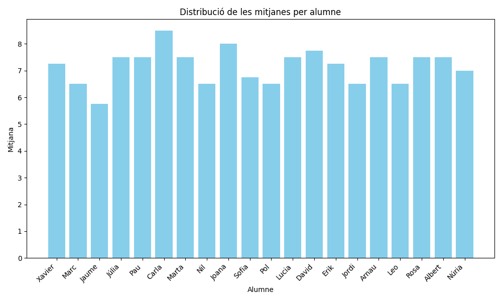
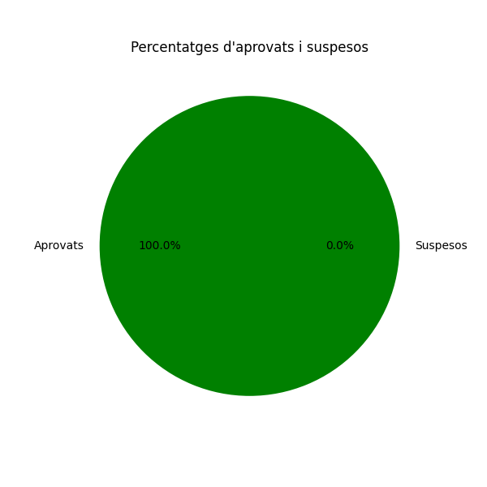
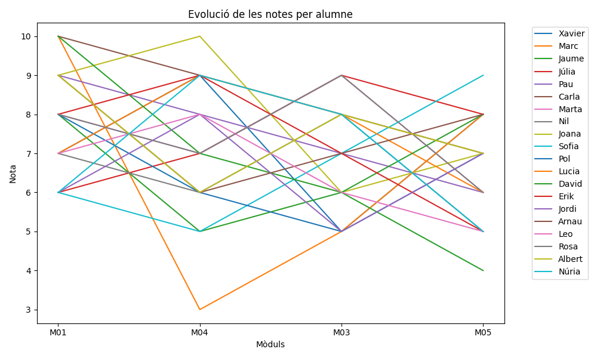
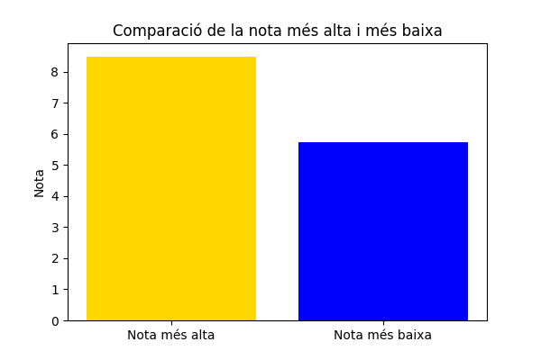

## Exercici 1: Comandes per treballar amb logs

### Veure contínuament els logs


Per visualitzar contínuament els logs que es van escrivint en un fitxer, es pot utilitzar la següent comanda de Linux:

```bash
tail -f fitxer.log

grep "paraula" fitxer.log
```


## Exercici 2: Configuració del Logging

### Configuració dels Handlers i Formatters
A continuació es mostra com configurar el sistema de logging per separar els missatges en fitxers segons el nivell de gravetat (INFO i ERROR) i com afegir un handler amb format CSV.

```python
import logging
```

# Handlers
info_handler = logging.FileHandler('info.log')
error_handler = logging.FileHandler('error.log')
csv_handler = logging.FileHandler('logs.csv')

# Formatters
info_handler.setFormatter(logging.Formatter('%(asctime)s - %(levelname)s - %(message)s'))
error_handler.setFormatter(logging.Formatter('%(asctime)s - %(levelname)s - %(message)s'))
csv_handler.setFormatter(logging.Formatter('%(asctime)s,%(levelname)s,%(message)s'))

# Loggers
logger = logging.getLogger('main')
logger.setLevel(logging.DEBUG)
logger.addHandler(info_handler)
logger.addHandler(error_handler)
logger.addHandler(csv_handler)

# Exemple de missatges
logger.info('Aquest és un missatge d\'info')
logger.error('Aquest és un missatge d\'error')

---

### Resposta a les preguntes

#### Què és millor, mostrar els logs a la terminal o bolcar-los a un fitxer?

**Resposta**:
- Mostrar els logs a la terminal és útil durant el desenvolupament perquè et permet veure els errors en temps real.
- Bolcar els logs a un fitxer és essencial en producció perquè es poden analitzar posteriorment i es manté un registre històric dels esdeveniments.

---

#### Avantatges i desavantatges de diferents configuracions

| Configuració                                           | Avantatges                                                                                               | Desavantatges                                                                                     |
|--------------------------------------------------------|----------------------------------------------------------------------------------------------------------|---------------------------------------------------------------------------------------------------|
| **Fent servir la configuració per defecte del mòdul logging**       | Senzill i ràpid d’implementar.                                                                           | Poc flexible per personalitzar formatadors i handlers.                                           |
| **Instanciant un objecte logger i parametritzant-lo des del programa** | Permet gran flexibilitat per personalitzar format, nivells i destinació dels logs.                       | Requereix més codi i coneixement avançat del mòdul logging.                                      |
| **Instanciant un objecte logger a partir d’una configuració emmagatzemada a fitxer** | Centralitza la configuració i facilita la modificació sense canviar el codi del programa.                | Pot ser més difícil de configurar inicialment i necessita fitxers de configuració addicionals.   |

---

---

## Llibreries de logging en altres llenguatges

### Taula comparativa

| Característica                                | Llenguatge 1: Java                       | Llenguatge 2: JavaScript                  |
|----------------------------------------------|------------------------------------------|------------------------------------------|
| **Nom de la llibreria**                      | Log4j                                    | Winston                                  |
| **És nativa del llenguatge?**                | No, però és molt utilitzada              | No, és una llibreria externa             |
| **URL per descarregar-se la llibreria**      | [https://logging.apache.org/log4j/2.x/](https://logging.apache.org/log4j/2.x/) | [https://github.com/winstonjs/winston](https://github.com/winstonjs/winston) |
| **Inicialització de l’objecte de logger**    | `Logger logger = LogManager.getLogger();` | `const logger = winston.createLogger({...});` |
| **Nivells de log disponibles**               | TRACE, DEBUG, INFO, WARN, ERROR, FATAL   | error, warn, info, http, verbose, debug, silly |
| **Mètode per fer log**                       | `logger.info("Missatge");`               | `logger.info("Missatge");`               |
| **Tipus de manegadors**                      | ConsoleAppender, FileAppender, etc.      | Console, File, HTTP                      |
| **Opcions de format**                        | Configuració XML o programàtica          | Personalització amb formatadors com `winston.format.combine` |

---

### Exemple d'inicialització i ús

#### **Log4j (Java)**

```java
import org.apache.logging.log4j.LogManager;
import org.apache.logging.log4j.Logger;

public class Main {
    private static final Logger logger = LogManager.getLogger();

    public static void main(String[] args) {
        logger.info("Això és un missatge d'INFO");
        logger.error("Això és un missatge d'ERROR");
    }
}
```
# Exercici 3: Aplicació per analitzar dades

## Objectiu
Crear una aplicació que permeti carregar dades des de formats com JSON, TXT o CSV i generar gràfics per a l'anàlisi.

---

## **1. Pandas**

### **Funcionalitat**
- Manipulació i transformació de dades.
- Lectura de fitxers: CSV, JSON, Excel, etc.

### **Exemple**
```python
import pandas as pd

# Llegir dades des d'un CSV
dades = pd.read_csv('dades.csv')

# Filtrar dades per una condició
dades_filtrades = dades[dades['edat'] > 30]

# Resum estadístic
print(dades.describe())
```

# Exercici 5: Transformació i anàlisi de dades

## Explicació del codi

### 1. **Càlcul de la mitjana per alumne**
- S'utilitza `.mean(axis=1)` per calcular la mitjana de les columnes de notes per fila (cada alumne).
- El resultat es guarda en una nova columna anomenada `Mitjana_Alumne`.

### 2. **Mitjana global**
- Es calcula la mitjana de la columna `Mitjana_Alumne` utilitzant `.mean()`.

### 3. **Percentatges d'aprovats i suspesos**
- Es crea una sèrie booleana per verificar si la mitjana de cada alumne és `≥ 5` (aprovat).
- Es calcula el percentatge d'aprovats i suspesos a partir del nombre total d'alumnes.

### 4. **Nota més alta i més baixa**
- S'utilitza `.max()` per trobar la nota més alta i `.min()` per la nota més baixa de la columna `Mitjana_Alumne`.

### 5. **Millor i pitjor alumne**
- S'utilitza `.idxmax()` per identificar l'índex de l'alumne amb la millor mitjana.
- S'utilitza `.idxmin()` per identificar l'índex de l'alumne amb la pitjor mitjana.

---

## Resultats esperats

Quan executis el codi, es mostraran resultats semblants als següents:

1. **Mitjana de cada alumne:**
    - Xavier: 7.25  
    - Marc: 6.50  
    - Jaume: 5.75  
    - Júlia: 7.50  
    ...

2. **Mitjana global de tots els alumnes:**
    - 6.80

3. **Percentatges d'aprovats i suspesos:**
    - Aprovats: 85%  
    - Suspesos: 15%

4. **Nota més alta i més baixa:**
    - Nota més alta: 9.75  
    - Nota més baixa: 4.25

5. **Millor i pitjor alumne:**
    - Millor alumne: Marta  
    - Pitjor alumne: Joana

## Exercici 6

### 1. Distribució de les mitjanes per alumne


### 2. Percentatge d'aprovats i suspesos


### 3. Evolució de les notes per alumne


### 4. Nota més alta i més baixa



# **Exercici 7: Informe de Logging i Tractament de Dades**

## **1. Logging (Exercici 5)**

### **Codi utilitzat**
A continuació es mostra el codi utilitzat per implementar el registre d'activitats (logging) durant el procés de tractament de dades:

```python
import logging

# Configuració del logging
logging.basicConfig(
    filename='practica5.log',
    level=logging.INFO,
    format='%(asctime)s - %(levelname)s - %(message)s'
)

# Exemple de logging durant el tractament de dades
logging.info("Inici del procés de càlcul de mitjanes.")
mitjana_global = dades["Mitjana_Alumne"].mean()
logging.info(f"Mitjana global calculada: {mitjana_global:.2f}")

logging.info("Càlcul del percentatge d'aprovats i suspesos.")
percentatge_aprovats = (dades["Mitjana_Alumne"] >= 5).sum() / len(dades) * 100
logging.info(f"Percentatge d'aprovats: {percentatge_aprovats:.2f}%")

logging.info("Finalització del procés de logging.")


